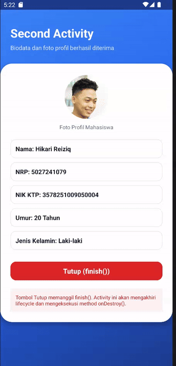
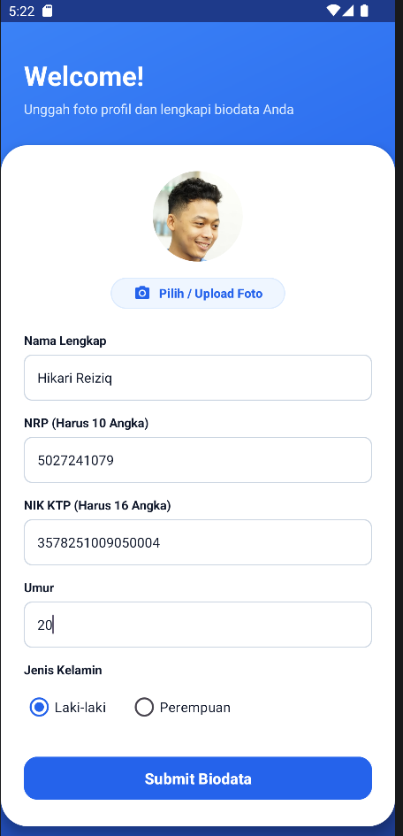
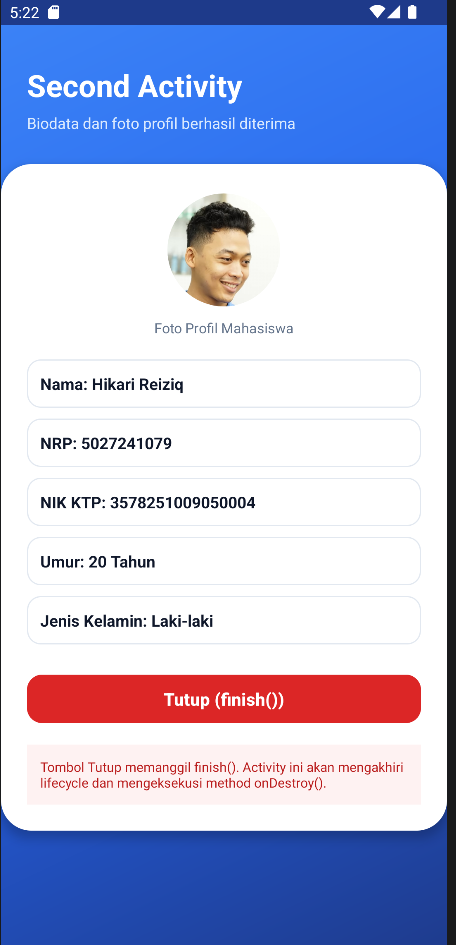

# Android Form — Explicit Intent & Activity Lifecycle

Aplikasi Android untuk pengisian formulir biodata mahasiswa lengkap dengan fitur unggah foto profil, navigasi antar Activity menggunakan **Explicit Intent**, serta demonstrasi siklus hidup Activity (**Activity Lifecycle**) menggunakan `finish()` dan `onDestroy()`.

---

## 🎬 Demo Aplikasi (Live Preview)

<div align="center">
  
  <p><em>Demonstrasi alur pengisian biodata, upload foto, Explicit Intent, dan penutupan Activity (onDestroy)</em></p>
</div>

---

## 📱 Tangkapan Layar (Screenshots)

| Halaman Utama (Form Biodata & Upload Foto) | Halaman Kedua (Hasil Tampilan Biodata) |
| :---: | :---: |
|  |  |

---

## ✨ Fitur Utama

1. **Pengisian Biodata Lengkap**:
   - **Nama Lengkap**: Validasi wajib diisi.
   - **NRP (Nomor Induk Mahasiswa)**: Validasi angka wajib tepat 10 digit.
   - **NIK KTP**: Validasi angka wajib tepat 16 digit.
   - **Umur**: Input numerik usia mahasiswa.
   - **Jenis Kelamin**: Pemilihan gender dinamis menggunakan `RadioGroup` & `RadioButton` (Laki-laki / Perempuan).

2. **Upload Foto Profil**:
   - Memilih foto dari galeri perangkat secara aman menggunakan `ActivityResultContracts.GetContent()`.
   - Menampilkan *circular avatar preview* pada `ShapeableImageView`.
   - Mengirimkan *URI* foto ke Activity tujuan dengan izin akses baca (*read URI permission*).

3. **Explicit Intent**:
   - Mengarahkan alur aplikasi secara eksplisit dari `MainActivity` menuju `SecondActivity`.
   - Mengirimkan data biodata dan *URI* foto melalui `putExtra()` dan `setData()`.

4. **Activity Lifecycle & Tombol Tutup**:
   - Tombol **Tutup (`finish()`)** pada `SecondActivity` mengakhiri siklus hidup Activity.
   - Menguji dan mendemonstrasikan fase `onDestroy()` dengan pesan notifikasi `Toast` saat Activity dihancurkan dari memori.

5. **Auto-Reset Form**:
   - Saat pengguna kembali ke halaman utama (setelah menekan tombol Tutup di `SecondActivity`), seluruh input formulir dan foto profil otomatis di-reset menjadi kosong kembali melalui method `onRestart()`.

6. **Desain Modern Khas Biru (Material 3)**:
   - Header gradient biru modern (*Deep Navy* ke *Royal Blue*).
   - *Floating White Card* dengan sudut lengkung halus (*radius 28dp*).
   - Tipografi yang bersih dan palet warna kontras tinggi yang nyaman di mata.

---

## 🛠️ Teknologi & Spesifikasi

- **Bahasa Pemrograman**: Java
- **UI Framework**: Android XML, Material Components (Material 3)
- **Min SDK**: API 26 (Android 8.0 Oreo)
- **Target SDK**: API 37
- **Build System**: Gradle Kotlin DSL (`build.gradle.kts`)

---

## 📂 Struktur Proyek

```text
Intent_Activity/
├── app/
│   ├── src/
│   │   └── main/
│   │       ├── java/com/example/intent_activity/
│   │       │   ├── MainActivity.java       # Form input, upload foto, validasi, & Explicit Intent
│   │       │   └── SecondActivity.java     # Penerima data Intent, display foto, & tombol finish()
│   │       ├── res/
│   │       │   ├── drawable/               # Asset background, icon kamera, frame foto, & card
│   │       │   ├── layout/
│   │       │   │   ├── activity_main.xml   # Layout form input & upload foto
│   │       │   │   └── activity_second.xml # Layout tampilan biodata & tombol tutup
│   │       │   └── values/
│   │       │       ├── colors.xml          # Palet warna nuansa biru modern
│   │       │       └── themes.xml          # Tema Material3 & circular image style
│   │       └── AndroidManifest.xml         # Registrasi MainActivity & SecondActivity
│   └── build.gradle.kts
├── Image/
│   ├── demo.gif                            # Animasi demo aplikasi (auto-play)
│   ├── Halaman_Utama.png                   # Screenshot Halaman 1
│   └── Halaman_Kedua.png                   # Screenshot Halaman 2
└── README.md
```

---

## 🚀 Cara Menjalankan

1. **Clone repositori ini**:
   ```bash
   git clone https://github.com/HikariReiziq/Android_Form.git
   ```
2. Buka folder proyek menggunakan **Android Studio**.
3. Tunggu proses **Gradle Sync** selesai.
4. Hubungkan perangkat fisik (USB Debugging aktif) atau jalankan **Android Emulator**.
5. Klik tombol **Run** (ikon segitiga hijau) atau tekan tombol `Shift + F10`.

---

## 👤 Author

- **GitHub**: [@HikariReiziq](https://github.com/HikariReiziq)
- **Repository**: [https://github.com/HikariReiziq/Android_Form](https://github.com/HikariReiziq/Android_Form)
